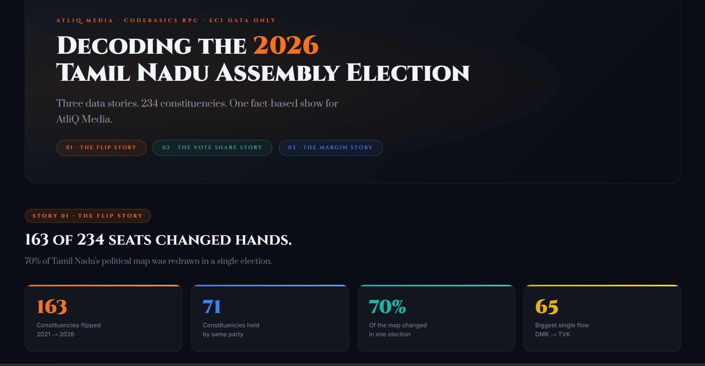

#  Decoding the 2026 Tamil Nadu Assembly Election 2026

## Data-Driven Dashboard and Election Briefing

This project presents a data-driven analysis of the 2026 Tamil Nadu Assembly Election, with comparisons against the 2021 election to understand regional seat redistribution, constituency-level flips, and vote-share realignment.



## 🔗 Live Dashboard
👉 [View Live Dashboard](https://tn-election-2026-scazkhofytxkx78hcbh2gk.streamlit.app/)


**Codebasics Resume Project Challenge** · Data Analytics · May 2026

---

## What this project is

AtliQ Media is building a one-hour fact-based TV show on the 2026 Tamil Nadu Assembly results. This is the data backbone — three stories, clean charts, and an editorial recommendation for the anchor desk. No debates. No commentary. Just numbers.

---

## The Three Stories

**1. The Flip Story**
163 of 234 constituencies had a different winner in 2026 than in 2021. That's 70% of the map changing hands in a single election. The biggest flow: 65 seats moved from DMK to TVK, 26 from AIADMK to TVK.

**2. The Vote Share Story**
TVK — a party that did not exist in 2021 — debuted at 34.9% of the statewide vote, ahead of both DMK (24.2%) and AIADMK (21.2%). DMK lost 13.5 percentage points from its 2021 tally. AIADMK lost 12.1. The arithmetic points in one direction.

**3. The Margin Story**
The average winning margin fell from 22,871 votes in 2021 to 16,784 in 2026 — a drop of 26.6%. In 64 constituencies, the winner crossed the line with less than 35% of valid votes. In only 13 did any candidate cross 50%. This was a closer election than it looked on the seat count.

---

## Files

```
├── tn_election_analysis.ipynb   # Full analysis — run in Google Colab
├── tn_2021_results.csv          # 4,232 rows · Trivedi Centre, Ashoka University
├── tn_2026_results.csv          # 4,257 rows · Election Commission of India
├── constituency_master.csv      # 234 constituencies · regions, districts, reservation
└── README.md
```

---

## How to Reproduce

1. Open `tn_election_analysis.ipynb` in [Google Colab](https://colab.research.google.com)
2. Upload the three CSV files using the Files panel on the left
3. Run all cells top to bottom — no additional installs needed

Everything is self-contained. The notebook produces all charts used in the deck.

---

## Data Sources

| File | Source |
|------|--------|
| `tn_2021_results.csv` | Trivedi Centre for Political Data, Ashoka University |
| `tn_2026_results.csv` | Election Commission of India · results.eci.gov.in |
| `constituency_master.csv` | ECI constituency master list |

No exit polls. No news articles. No social media. Only public ECI data.

---

## Research Questions Answered

From the Codebasics brief — three of six questions, connected into one story:

- **Q2 · The Flip Story** — constituency-level winner changes, 2021 → 2026
- **Q3 · The Vote Share Story** — party vote share state-wide and by region
- **Q6 · The Margin Story** — average margin change and win-percentage distribution

---

## Disclaimer

Non-partisan analysis using only publicly available Election Commission of India data. No political position is expressed or implied. No party symbols, leader images, or causal claims appear anywhere in this project.

